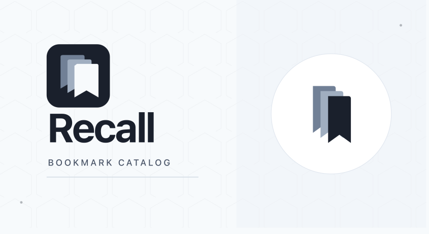
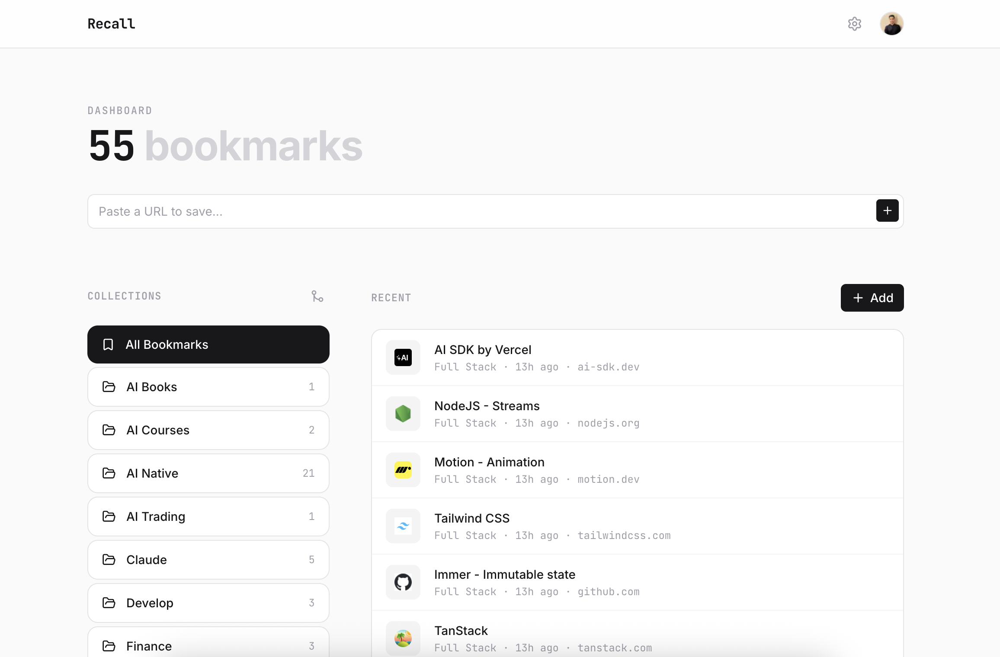
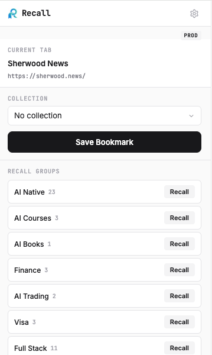

<p align="center">
  
</p>

# Recall

**Precision bookmark organization. Your digital library, evolved into a high-performance utility.**

Recall is a minimalistic bookmark tracker with a web app and Chrome extension. Save, categorize, and open bookmarks as Chrome tab groups — all with surgical precision.

🌐 [Live App](https://recall.ltd) · [Issues](https://github.com/adityakamble49/Recall/issues)



---

## Overview

Recall solves the problem of scattered bookmarks across browsers and devices. Instead of a flat list, bookmarks are organized into **collections** that can be opened as **Chrome tab groups** with one click.

<table>
<tr>
<td>

### Key Features

- **Collections** — Organize bookmarks into named collections, rename, merge, and delete
- **Chrome Tab Groups** — Recall a collection as a Chrome tab group, or Snap a tab group into a collection
- **Chrome Extension** — Save the current tab, edit title, Recall collections as tab groups, Snap tab groups as collections
- **Instant Capture** — Quick URL paste on the dashboard for rapid bookmarking
- **Move & Organize** — Move bookmarks between collections, favorite, and delete
- **Duplicate Detection** — Prevents saving the same URL twice in a collection
- **Live Reload** — Dashboard auto-refreshes when bookmarks change from another session
- **Dev/Prod Toggle** — Extension supports switching between local and production environments
- **Responsive** — Single-page dashboard works on desktop and mobile

</td>
<td>



</td>
</tr>
</table>

### Tech Stack

| Layer | Technology |
|-------|-----------|
| Framework | Next.js 16 (App Router, Server Actions) |
| UI | React 19, Tailwind CSS v4, Inter + JetBrains Mono |
| Database | Neon PostgreSQL (serverless) |
| ORM | Drizzle ORM |
| Auth | NextAuth v5 (Google OAuth) |
| Icons | Lucide React |
| Hosting | Vercel |
| Extension | Chrome Manifest V3 |

---

## Quick Start

### Prerequisites

- **Node.js** 18+
- **npm** 9+
- A **Neon** PostgreSQL database ([neon.tech](https://neon.tech))
- **Google OAuth** credentials ([console.cloud.google.com](https://console.cloud.google.com/apis/credentials))

### 1. Clone & Install

```bash
git clone https://github.com/adityakamble49/Recall.git
cd Recall
npm install
```

### 2. Environment Setup

Copy the example env file and fill in your values:

```bash
cp .env.example .env.local
```

```env
DATABASE_URL=postgresql://...
AUTH_SECRET=your_auth_secret_here
AUTH_GOOGLE_ID=your_google_client_id
AUTH_GOOGLE_SECRET=your_google_client_secret
```

Generate `AUTH_SECRET`:

```bash
openssl rand -base64 33
```

### 3. Database Setup

Push the schema to your Neon database:

```bash
npx drizzle-kit push
```

### 4. Run Development Server

```bash
npm run dev
```

Open [http://localhost:3030](http://localhost:3030).

---

## Chrome Extension

The Chrome extension lets you save the current tab to any collection and open collections as tab groups.

### Install (Developer Mode)

1. Open `chrome://extensions` in Chrome
2. Enable **Developer mode** (toggle top-right)
3. Click **Load unpacked**
4. Select the `extension/` folder from this repo

### Connect to Your Account

1. Go to **Settings** in the Recall web app
2. Click **Generate Extension Token**
3. Copy the token
4. Click the Recall extension icon → paste the token → **Connect**

### Dev / Prod Toggle

- Click the ⚙️ gear icon in the extension header
- Toggle between **DEV** and **PROD**
- Each environment can have its own token

---

## iOS Share Sheet (via Shortcuts)

Save links from any iOS app (Safari, Twitter, Reddit, etc.) directly to Recall using an iOS Shortcut.

### Setup

1. Open **Shortcuts** app → tap **+** → name it **Save to Recall**
2. Add these actions in order:

| # | Action | Configuration |
|---|--------|--------------|
| 1 | **Receive input** | Accept: URLs only |
| 2 | **Text** | Paste your Recall API token |
| 3 | **Get Contents of URL** | URL: `https://recall.ltd/api/bookmarks` — Method: POST — Header: `Authorization: Bearer <Text>` — Body (JSON): `url` = Shortcut Input, `title` = Shortcut Input |
| 4 | **Show Notification** | `✓ Saved to Recall` |

3. Tap **ⓘ** at the bottom → enable **Show in Share Sheet**
4. Done — "Save to Recall" now appears when you share any link on iOS

> Get your API token from **Settings → Chrome Extension** in the Recall web app.

---

## Database Schema

```
user              # NextAuth users (Google OAuth)
account           # OAuth provider accounts
session           # Active sessions
verificationToken # Email verification tokens
collections       # Bookmark collections (name, description, icon, color, isPinned)
bookmarks         # Bookmarks (title, url, favicon, collectionId, isFavorite, isArchived)
api_tokens        # Extension API tokens (bearer auth)
```

To update the schema after changes:

```bash
# Dev
npx drizzle-kit push

# Prod (with prod DATABASE_URL)
DATABASE_URL="your_prod_url" npx drizzle-kit push
```

---

## Deployment

### Vercel

1. Push to GitHub
2. Import the repo on [vercel.com](https://vercel.com)
3. Add environment variables: `DATABASE_URL`, `AUTH_SECRET`, `AUTH_GOOGLE_ID`, `AUTH_GOOGLE_SECRET`
4. Deploy

### Environment Variables

| Variable | Description |
|----------|-------------|
| `DATABASE_URL` | Neon PostgreSQL connection string |
| `AUTH_SECRET` | NextAuth session encryption secret |
| `AUTH_GOOGLE_ID` | Google OAuth client ID |
| `AUTH_GOOGLE_SECRET` | Google OAuth client secret |

---

## License

MIT
